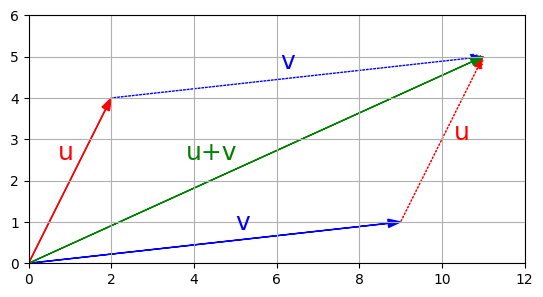
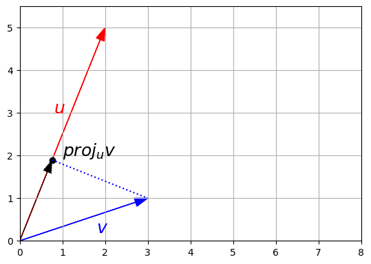

# Basic Vector Operations with NumPy

Using Numpy in Preparation for Pytorch
Sources: 3b1b and [Here](https://github.com/ageron/handson-ml3/blob/main/math_linear_algebra.ipynb)

> **Tags:** Theory, Machine Learning

----------

## Vector Addition

Vectors can only be added if they are the same size. Addition is _element-wise_.

```
# Using lists
u = [1, 2, 3]
v = [3, 4, 5]
print(" ", u)
print("+", v)
print("-"*10)
print([v[i] + u[i] for i in range(len(u))])
```

```
import numpy as np

# Using numpy
u = np.array([2, 4])
v = np.array([9, 1])
print(" ", u)
print("+", v)
print("-"*10)
u + v
```


<p class="text-center m-auto italic">Figure 1. A visualization of vector addition</p>

Subtracting a vector can be thought of as adding a negative vector.

## Scalar Multiplication

(using Numpy) e.g. x * **v** = [...]

## Dot Product

u • v = ||u|| * ||v|| * cos(θ), where θ is the angle between the vectors.

OR

u • v = (u1 * v1) + (u2 * v2) + ... + (uk * vk)

where u and v are vectors of length k.

For example, [2 4 6] • [2 4 6] = (2 * 2) + (4 * 4) + (6 * 6) = 4 + 16 + 36 = 56

```
# Using lists
u = np.array([2, 4, 6])
v = np.array([2, 4, 6])

dot_product = sum(ui * vi for ui, vi in zip(u, v))
print(dot_product)

# Using numpy
print(np.dot(v, u))
print(u.dot(v))
print(v.dot(u))
```

## Norm

Equal to the square root of the sum of the squares of all the components of **u**. Also equal to the square root of the dot product of **u**.

```
# Lists
u = [2, 5]
sum(ui ** 2 for ui in u) ** 0.5

# Numpy
np.linalg.norm(u)
```

## Vector Normalization

A vector divided by its norm (i.e. a unit vector sharing the same direction as the original vector) is called a normalized vector.

## Angle between vectors

θ = arccos(u • v / ||u|| * ||v||)

```
u = np.array([2, 5])
v = np.array([3, 1])

cos_theta = u.dot(v) / np.linalg.norm(u) / np.linalg.norm(v)
theta = np.arccos(cos_theta.clip(-1, 1))

print("Angle =", theta, "radians")
print("      =", theta * 180 / np.pi, "degrees")
```

## Projection

The projection of vector v onto vector u is defined as:

(u • v) / ||u||2 * **u**

and can be thought of as laying **v** on top of **u**.

```
(u.dot(v) / np.linalg.norm(u) ** 2) * u
```


<p class="text-center m-auto italic">Figure 2. The projection of a vector v onto vector u</p>
