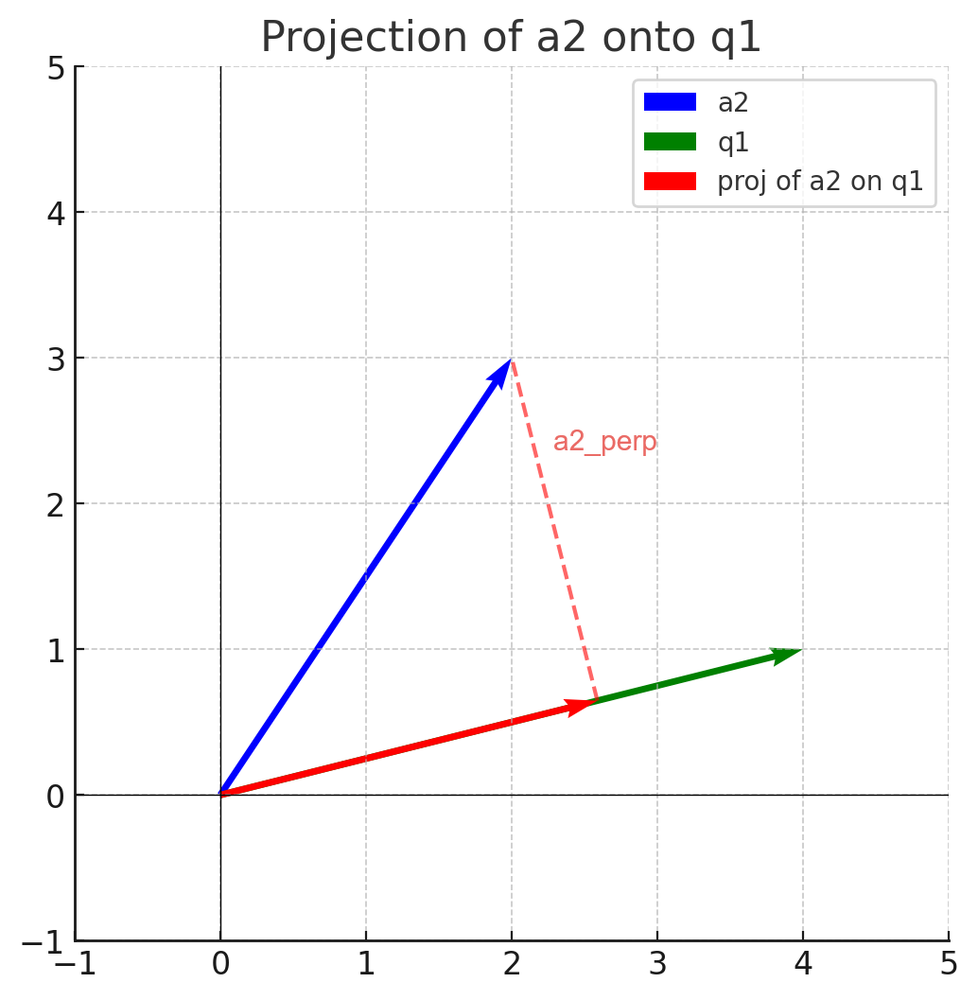
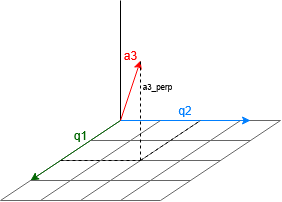

# QR Decomposition with NumPy

Using Numpy for QR Decomposition and RQ Decomposition

> **Tags:** Mathematics, Computer Vision

----------

## Definition

QR decomposition is a process of taking any real matrix, A, and representing it as an orthogonal matrix Q and an upper-triangular matrix R, i.e. A = QR.

An orthogonal matrix is one such that all its column vectors are perpendicular to each other and of unit norm, and an upper-triangular matrix has non-zero elements only on or above the diagonal. 

This is useful in a number of applications, including camera calibration in computer vision. 

The QR decomposition can be computed using the Gram-Schmidt process.

## Gram-Schmidt

Goal: Represent A as a multiplication of an orthogonal matrix Q and an upper-triangular matrix R. 

Let Q = [q1, q2, q3], where qi is a 3x1 vector. Set q1 = a1 / ||a1|| to start, then calculate the other vectors. Notice how we divide by the norm of a1, ||a1||, so that q1 has unit-norm.

R contains the column vectors that takes our orthonormal vectors in Q back to their corresponding vectors in A. To get a1 back from q1, we simply multiply q1 by the norm of a1 and zero out the other vectors. Therefore, set the top-left element of R to be the norm of a1. 

We need q2 to be perpendicular to a1. We can get q2 by using the perpendicular component of the projection of a2 onto q1, where the projection is given by Proj_q1(a2) = &lt;a2 ⋅ q1>q1.



The perpendicular component, a1_perp, is equal to the original vector a2 minus the projection component, or a2 - Proj_q1(a2).

This gives us our perpendicular vector to q1. Since Q consists of orthonormal vectors, divide a1_perp by its norm to get q2. 

q2 = a1_perp / ||a1_perp||

To get a2 back from a linear combination of q1, q2, and q3, we need to multiply q1 by &lt;a2 ⋅ q1>, then add q2 scaled by the norm of ||a1_perp||. 

Then, for q3, we need a vector that is perpendicular to both q1 and q2, which can be visualized in three-dimensional space. Therefore, repeat the prior steps, but calculate the projection of q3 onto both q1 and q2.



a3_perp = &lt;a3 * q1>q1 - &lt;a3 * q2>q2

q3 = a3_perp / ||a3_perp||

To get a3 back from a linear combinations of the vectors in Q, we add &lt;a3 * q1>q1, &lt;a3 * q2>q2, and ||a3||q3, i.e.

a3 = &lt;a3 * q1>q1 + &lt;a3 * q2>q2 + ||a3||q3

Thus, the final column of R will contain the scalars that multiply the corresponding vectors of Q to get a3.

This leaves us with two matrices, Q and R, such that A = QR.

## Code

```
M = np.random.rand((3, 3))

Q = np.zeros((3, 3))
R = np.zeros((3, 3))
for i in range(0, M.shape[1]):
  ai = M[:, i]
  ai_perp = ai

  for j in range(0, i):
    qj = Q[:, j]
    dot_prod = (ai @ qj)
    ai_perp -=  dot_prod * qj
    R[j, i] = dot_prod

  ai_perp_norm = np.linalg.norm(ai_perp)
  R[i, i] = ai_perp_norm
  q = (ai_perp / ai_perp_norm)
  Q[:, i] = q[:]
```

## Camera Calibration

Given a calibration matrix P, we can use QR decomposition to find the intrinsic parameter matrix K and the extrinsic parameter matrix R. 

The camera calibration matrix P contains the 3x3 upper-left submatrix M, where M = KR. K and R can be dervied by taking the QR decomposition of M^-1. Techically, this is taking the RQ decomposition of M. 

Note that the "R" matrix in QR decomposition does not correspond with the extrinsic parameter matrix "R" in camera calibration. To avoid confusion, I will refer to the upper-triangular matrix R as U during the calculations. 
- Q: Orthogonal Matrix
- U: Upper-Triangular Matrix

Want: M = KR = UQ 

M^(−1) = QU

(M^(−1))^(−1) = (QU)^(−1)

M = U^(−1)Q

Since U is upper-triangular, so is U^(−1). Similarly, since Q is orthogonal, so is
Q^(−1) = QT . Therefore,
- K = U^(−1)
- R = QT

```
M_inv = np.linalg.inv(M)

Q = np.zeros((3, 3))
R = np.zeros((3, 3))
for i in range(0, M_inv.shape[1]):
  ai = M_inv[:, i]
  ai_perp = ai

  for j in range(0, i):
    qj = Q[:, j]
    dot_prod = (ai @ qj)
    ai_perp -=  dot_prod * qj
    R[j, i] = dot_prod

  ai_perp_norm = np.linalg.norm(ai_perp)
  R[i, i] = ai_perp_norm
  q = (ai_perp / ai_perp_norm)
  Q[:, i] = q[:]

K = np.linalg.inv(R)
R = Q.T
```